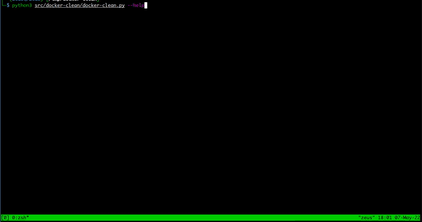

# Docker-Clean

[Artigo de referência](http://www.macoratti.net/19/02/dock_limp1.htm) Este script python foi inspirado num artigo sobre como
remover imagens, containers e volumes. Tudo com a finalidade de auxiliar na limpeza de ambientes de desenvolvimento, após a grande facilidade de criação de ambientes docker.

O script executa uma limpeza na maquina de desenvolvimento.



## Skills


## Installation

Use [git](https://github.com/jmreis/getrfc.git).

```bash
git clone https://github.com/jmreis/getrfc.git
```

```bash
_____________________________________
⣿⣿⣿⣿⣿⣿⣿⣿⣿⣿⣿⣿⣿⡟⠛⠛⢻⣿⣿⣿⣿⣿⣿⣿⣿⣿⣿⣿⣿⣿
⣿⣿⣿⣿⣿⣿⣿⣿⣿⣿⣿⣿⣿⣇⣀⣀⣸⣿⣿⣿⣿⣿⣿⣿⣿⣿⣿⣿⣿⣿
⣿⣿⣿⣿⣿⣿⣿⠀⠀⢸⡇⠀⠀⡇⠀⠀⢸⣿⣿⣿⣿⣿⡟⠻⣿⣿⣿⣿⣿⣿
⣿⣿⣿⡿⠿⠿⣿⠶⠶⢾⡷⠶⠶⡷⠶⠶⢾⠿⠿⠿⣿⣿⠀⠀⠈⣿⣿⣿⣿⣿
⣿⣿⣿⡇⠀⠀⣿⠀⠀⢸⡇⠀⠀⡇⠀⠀⢸⠀⠀⠀⣿⣿⡀⠀⠀⠀⠀⠀⢉⣿
⣿⠉⠉⠉⠉⠉⠉⠉⠉⠉⠉⠉⠉⠉⠉⠉⠉⠉⠉⠉⠉⠉⠀⠀⢀⣀⣠⣴⣿⣿
⣿⠀⠀⠀⠀⠀⠀⠀⠀⠀⠀⠀⠀⠀⠀⠀⠀⠀⠀⠀⠀⠀⠀⢀⣾⣿⣿⣿⣿⣿
⣿⡇⠀⠀⠀⠀⠀⠀⠀⠀⠀⠀⠀⠀⠀⠀⠀⠀⠀⠀⠀⠀⢀⣾⣿⣿⣿⣿⣿⣿
⣿⣿⡄⠀⠀⠀⠀⠀⠀⠀⠀⠀⠀⠀⠀⠀⠀⠀⠀⠀⢀⣴⣿⣿⣿⣿⣿⣿⣿⣿
⣿⣿⣿⣦⡀⠀⠀⠀⠀⠀⠀⠀⠀⠀⠀⠀⠀⢀⣠⣴⣿⣿⣿⣿⣿⣿⣿⣿⣿⣿
⣿⣿⣿⣿⣿⣷⣶⣦⣤⣤⣤⣤⣤⣤⣶⣶⣿⣿⣿⣿⣿⣿⣿⣿⣿⣿⣿⣿⣿⣿

        DOCKER-CLEAN
        by Jair Reis
```

## Contributing
Pull requests são bem-vindos. Para mudanças importantes, abra um problema primeiro para discutir o que você gostaria de mudar.

Certifique-se de atualizar os testes conforme apropriado.

## License
[MIT](https://choosealicense.com/licenses/mit/)
